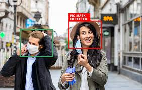
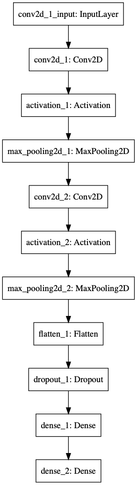

## FaceMaskRecognition-Using-Tensorflow

Problem Statement

Face Mask Detection System is to Build a Face Mask Detection System that can detect a person in real-time if he/she is wearing a mask or not using CCTV camera with quite a good accuracy. After that, he/she is denied access to places where authorities have strictly asked to wear the face mask. After denying access to the person, authorities will get an alert email in real-time where the person’s photo will be attached. May be screen panels could be installed at the entrances where a person when denied can see a pop-up Warning Message where he/she would be advised to wear a mask before getting access. This kind of Face Mask Detection Alert System has applications at Airports, Hotels, Public Buildings like Driving Licence Offices, and other major places where we expect large public gatherings. 

It is solved using Python, OpenCV, Keras with Tensorflow as a backend for building the Deep Learning Convolution Neural Network model. 
This project is very useful to check Covid-19 spread.

